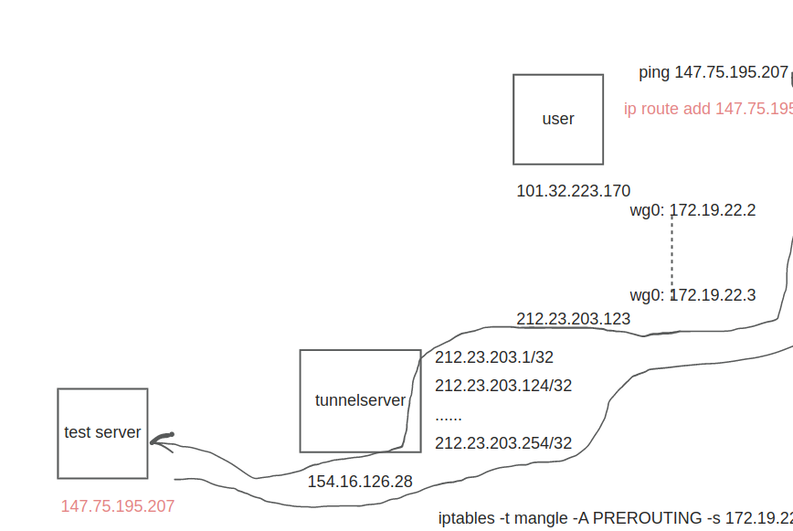

# Test Overview

In this test, three servers are involved. User first creates a tunnel to the tunnel server with specific ip
212.23.203.123, after passing through the tunnel, user's ip address is hidden and replaced by 212.23.203.123.
```
User: 101.32.223.170
tunnelserver: 154.16.126.28 (212.23.203.0/24)
test server: 147.75.195.207
```

# Test Diagram



# Setup Wireguard
### In user's pc
```
# cat /etc/wireguard/wg1.conf
[Interface]                                                       
Address = 172.19.22.2/32                                          
PostUp = ip route add 172.19.22.3/32 dev wg1                      
PrivateKey = SAFtzQO3zoFjUUiJ3WDMmUyfeicZnwX6dGTiM8TMw2g=         
Table = off                                                       
MTU = 1420                                                        
ListenPort=6790                                                   
                                                                  
[Peer]                                                            
PublicKey = 0xe+5q17RyZw48y1UYqalHQEa4pwbkYn8QNZyCGMUgQ=          
AllowedIPs = 0.0.0.0/0                                            
Endpoint = 212.23.203.123:6790                                    
PersistentKeepalive = 25                                          
```


### In tunnel server
```commandline
root@testing-1:~# cat /etc/wireguard/wg1.conf                 
[Interface]                                                   
Address = 172.19.22.3/32                                      
PostUp = ip route add 172.19.22.2/32 dev wg1                  
PrivateKey = iKmjQZrgqtneqQd0NP9EPC/Ug5r4gZhBEMpGy1DUXHQ=     
Table = off                                                   
MTU = 1420                                                    
ListenPort=6790                                               
                                                              
[Peer]                                                        
PublicKey = hhjLfwbrIq+tkZQjYSCsEtcqeBpnz2HmR426XRwfwVM=      
AllowedIPs = 0.0.0.0/0                                        
Endpoint = 101.32.223.170:6790                                
PersistentKeepalive = 25                                      
```

# Add routine to test server via tunnel
In user's server,
```commandline
#ip route add 147.75.195.207/32 via 172.19.22.3

#ip route list                       
default via 10.0.4.1 dev eth0 proto dhcp src 10.0.4.16 metric 100          
147.75.195.207 via 172.19.22.3 dev wg1                                     
172.19.22.3 dev wg1 scope link                                             
... ...
```
# Setup iptable rules to NAT user's traffic
In tunnel server,
```commandline
iptables -t mangle -A PREROUTING -s 172.19.22.2 -j MARK --set-mark 123
iptables -t nat -A POSTROUTING -m mark --mark 123 -j SNAT --to-source 212.23.203.123
```